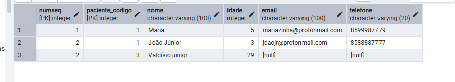

# 1. **Criação do banco de dados**
```sql
CREATE DATABASE hospital
    WITH
    OWNER = postgres
    ENCODING = 'UTF8'
    LC_COLLATE = 'Portuguese_Brazil.1252'
    LC_CTYPE = 'Portuguese_Brazil.1252'
    LOCALE_PROVIDER = 'libc'
    TABLESPACE = pg_default
    CONNECTION LIMIT = -1
    IS_TEMPLATE = False;
```
---
# 2. **Criações das tabelas**
## 2.1. criação da tabela paciente
```sql
CREATE TABLE paciente(
	codigo SERIAL PRIMARY KEY,
	nome VARCHAR(100) not null,
	idade INTEGER not null,
	email VARCHAR(100),
	telefone VARCHAR(20)
)
```
---
## 2.2. Criação da tabela plano_saude
```sql
CREATE TABLE plano_saude (
    codigo SERIAL PRIMARY KEY,
    categoria VARCHAR(50) NOT NULL,
	carencia_dias INTEGER,
	data_inicio DATE NOT NULL,
	data_desativacao DATE,
    paciente_codigo INTEGER NOT NULL,
    FOREIGN KEY (paciente_codigo) REFERENCES paciente(codigo)
);
```
## 2.3. Criação da tabela dependente
```sql
CREATE TABLE dependente (
    numSeq INTEGER NOT NULL,
    paciente_codigo INTEGER NOT NULL,
    nome VARCHAR(100) NOT NULL,
    idade INTEGER NOT NULL,
    email VARCHAR(100),
    telefone VARCHAR(20),

    PRIMARY KEY (numSeq, paciente_codigo),

    FOREIGN KEY (paciente_codigo)
        REFERENCES paciente(codigo)
        ON DELETE CASCADE
);
```
## 2.4. Criação da tabela medico
```sql
CREATE TABLE medico(
	codigo SERIAL PRIMARY KEY,
	crm VARCHAR(9) NOT NULL,
	nome VARCHAR(100) NOT NULL,
	especialidade VARCHAR(60),
	telefone VARCHAR(20),
	num_cons INTEGER NOT NULL,
	corredor_cons INTEGER NOT NULL,
	cod_computador_cons INTEGER NOT NULL
);
```
### 2.4.1 alteração consultorio unico
```sql
ALTER TABLE medico
ADD CONSTRAINT unico_consultorio
UNIQUE (num_cons, cod_computador_cons);
```
## 2.5. Criação da tabela consulta
```sql
CREATE TABLE consulta(
	dataCons DATE not null,
	horario TIME not null,
	medico_codigo INTEGER NOT NULL,
    paciente_codigo INTEGER NOT NULL,
	PRIMARY KEY(dataCons, horario, medico_codigo, paciente_codigo),
    senha VARCHAR(4),
	Emergencia BOOLEAN,
    FOREIGN KEY (medico_codigo) REFERENCES medico(codigo),
    FOREIGN KEY (paciente_codigo) REFERENCES paciente(codigo)
);
```
## 2.6. Criação da tabela medicamento
```sql
CREATE TABLE medicamento(
	codigo SERIAL PRIMARY KEY,
	laboratorio VARCHAR(20),
	nome VARCHAR(100) NOT NULL,
	rec_controle_especial BOOLEAN NOT NULL DEFAULT FALSE,
	observacoes TEXT
);
```
## 2.7. Criação da tabela prescricao
```sql
CREATE TABLE prescricao(
	medico_codigo INTEGER not null,
	paciente_codigo INTEGER not null,
	horario TIME not null,
	dataCons DATE not null,
	medicamento_codigo INTEGER not null,
	senha VARCHAR(4),
	emergencia BOOLEAN,
	FOREIGN KEY (dataCons, horario, medico_codigo, paciente_codigo)
        REFERENCES consulta (dataCons, horario, medico_codigo, paciente_codigo),
	FOREIGN KEY(medicamento_codigo)
		REFERENCES medicamento(codigo),
	PRIMARY KEY(medico_codigo,paciente_codigo,horario,dataCons, medicamento_codigo)
)
```
---
## 3. Inserção
## 3.1. Inserção de Dados: Paciente
```sql
INSERT INTO paciente(nome, idade, telefone) /*Como email é opcional não é necessário para inserir*/
VALUES ('João', 28, '8599987778');
```
## 3.2. Inserção de Dados: Plano de Saúde
```sql
INSERT INTO plano_saude(categoria, data_inicio, paciente_codigo, data_desativacao, carencia_dias) 
VALUES ('Basico', '2025-01-01', 1 , '2025-12-31', 0);
```
## 3.3. Inserção de Dados: Dependente
### 3.3.1. Informando numSeq
```sql
INSERT INTO dependente(numSeq, paciente_codigo ,nome, idade, telefone, email) 
VALUES (10, 1, 'Maria', 5, '8599987779', 'mariazinha@protonmail.com');/*Valor alto para numSeq para garantir unicidade*/
```
### 3.3.2. Sem informar, usando o trigger
```sql
INSERT INTO dependente(paciente_codigo ,nome, idade, telefone, email) 
VALUES ( 1, 'João Júnior', 3, '8588887777', 'joaojr@protonmail.com');
``` 
## 3.4 Inserção de Dados: Medico
```sql
INSERT INTO medico(crm, nome, especialidade, telefone, num_cons, corredor_cons, cod_computador_cons) 
VALUES ('123456/CE','Francisco de Souza', 'Otorrinolaringologista', '85987654321', 1, 1, 1);
```
## 3.5 Inserção de Dados: Consulta
```sql
INSERT INTO consulta(dataCons, horario, medico_codigo, paciente_codigo, senha, emergencia) 
VALUES ('2025-03-20','18:29', 1, 1, '99', FALSE);
```
## 3.6 Inserção de Dados: medicamento
```sql
INSERT INTO medicamento(laboratorio ,nome, rec_controle_especial, observacoes) 
VALUES ('europharma', 'eurotenol', TRUE, '2 comprimidos ao dia, 1 a cada 12h');
```
## 3.7 Inserção de Dados: Prescricao
```sql
INSERT INTO prescricao(dataCons, horario, medico_codigo, paciente_codigo, medicamento_codigo) 
VALUES ('2025-03-20','18:29', 1, 1, '1');
```
---
# 4. **Leitura**
## 4.1. leitura de Dados: Pacientes em ordem alfabética do nome
```sql
SELECT nome, codigo FROM paciente
ORDER BY nome ASC 
```
## 4.2. leitura de Dados: Plano de Saúde
```sql
SELECT categoria, codigo, data_inicio FROM plano_saude
ORDER BY codigo ASC 
```
## 4.3. leitura de Dados: Dependente
```sql
SELECT numSeq, nome FROM dependente
WHERE paciente_codigo = 1
ORDER BY numSeq ASC 
``` 
## 4.4 leitura de Dados: Medico
```sql
SELECT codigo, nome, crm FROM medico
ORDER BY codigo ASC 
```
## 4.5 leitura de Dados: Consulta
```sql
SELECT dataCons,horario ,paciente_codigo,medico_codigo FROM consulta
ORDER BY dataCons, horario ASC 
```
## 4.6. leitura de Dados: medicamento
```sql
SELECT laboratorio,nome, codigo FROM medicamento
ORDER BY laboratorio ASC 
```
## 4.7. leitura de Dados: prescricao
```sql
SELECT paciente_codigo, medico_codigo FROM prescricao
WHERE medicamento_codigo = 1
ORDER BY dataCons, horario, paciente_codigo, medico_codigo ASC 
```
# 5 **Atualização**:
```sql
UPDATE paciente
SET email = 'joaoprimeiropaciente@gmail.com',
WHERE codigo = 1;
```
# 6 **DELETE**:
```sql
DELETE FROM paciente
WHERE codigo = 2;
```
---
# 7. **Pesquisa por substring case-insensitive:**
```sql
SELECT * FROM medico
WHERE nome ILIKE '%a%';
```
---
# 8. **2 Consultas com tipos diferentes de JOIN**
## União externa à esquerda com os nomes dos medicos e id dos pacientes atendidos ou null
```sql
SELECT m.nome, c.paciente_codigo
FROM medico m
LEFT JOIN consulta c ON m.codigo=c.medico_codigo
``` 
## União externa total com os nome dos pacientes e medicamentos prescritos a eles
```sql
SELECT p.nome, pr.medicamento_codigo
FROM paciente p
FULL JOIN prescricao pr ON p.codigo = pr.paciente_codigo
```
---
# 9. **Consulta com ALL**: todos os pacientes mais velhos que seus dependentes
```sql
SELECT p.nome
FROM paciente p
WHERE idade > ALL (
    SELECT d.idade
    FROM dependente d
    WHERE d.paciente_codigo = p.codigo
);
```
---
# 10. **Consulta com ANY:** Médico que atende no consultorio mais próximo (menor número):
```sql
SELECT nome
FROM medico m1
WHERE num_cons < ANY (
    SELECT num_cons
    FROM medico m2
    WHERE m2.codigo != m1.codigo
);
```
# 11. **Consulta com funções agregadas, GROUP BY e HAVING**:
```sql
/*Consulta todos os médicos com apenas 1 prescrião no total*/
SELECT m.nome, COUNT(*) AS total_prescricoes
FROM prescricao p
JOIN medico m ON p.medico_codigo = m.codigo
GROUP BY m.codigo
HAVING COUNT(*) = 1; 
```
## 12. **Consulta com order by descendente:**
```sql
SELECT codigo, nome, num_cons FROM medico
ORDER BY num_cons DESC;
```
# 13. **Triggers**
## Trigger para inserir e autoincrementar dependente.numSeq a partir do ultimo valor para cada paciente
### Função do trigger
```sql
CREATE OR REPLACE FUNCTION gerar_numseq_dependente()
RETURNS TRIGGER AS $$
DECLARE
    ultimo_seq INTEGER;
BEGIN
    SELECT COALESCE(MAX(numSeq), 0) INTO ultimo_seq
    FROM dependente
    WHERE paciente_codigo = NEW.paciente_codigo;

    NEW.numSeq := ultimo_seq + 1;
    RETURN NEW;
END;
$$ LANGUAGE plpgsql;
```

## Trigger
```sql
CREATE TRIGGER trigger_gerar_numseq
BEFORE INSERT ON dependente
FOR EACH ROW
WHEN (NEW.numSeq IS NULL)
EXECUTE FUNCTION gerar_numseq_dependente();
```

# 14. Carga Inicial de dados
## pacientes

## dependentes

## planos

## medicos

## medicamentos

## consultas

## prescricoes
